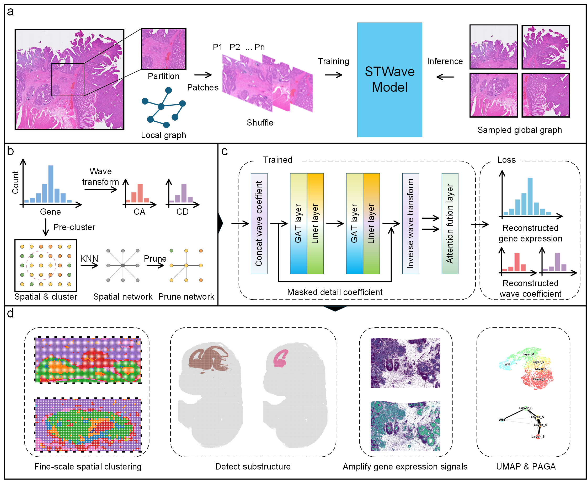

# STWave

This document will help you easily go through STWave model. 



## System Requirments

### OS requirements

```STWave``` can run on Linux and windows. The package has been tested on the following systems:

- Linux: Ubuntu 24.04.1, NVIDIA GeForce RTX 3080 Ti GPU.
- Windows: Windows 10 ,  NVIDIA GeForce RTX 4060 GPU.

```STWave``` requires python >= 3.9. We tested it in python 3.9.19 and cuda 11.8 on Linux.

## Installation Guide

### Clone STWave project

```shell
git clone https://github.com/TaoJiang999/STWave.git
cd STWave
```

### Create a virtual environment

```shell
conda create -n stwave python=3.9 r-base=4.4.2 r-mclust -c conda-forge -y
conda activate stwave
```

### Install packages

```shell
pip install -r requirements.txt   -i https://pypi.tuna.tsinghua.edu.cn/simple   --extra-index-url https://download.pytorch.org/whl/cu118   -f https://data.pyg.org/whl/torch-2.2.0+cu118.html
pip install pyg_lib torch_scatter torch_sparse torch_cluster torch_spline_conv -f https://data.pyg.org/whl/torch-2.2.0+cu118.html
pip install torch_geometric
```

### Check if the environment is available

```shell
python -c 'import rpy2'
python -c "import torch; print(torch.__version__, torch.cuda.is_available(), torch.version.cuda)"
```

### Install STWave

```shell
pip install .
```

## Usage

## Tutorial

For the step-by-step tutorial, please refer to: [STWave tutorial](https://github.com/TaoJiang999/STWave/tree/main/Tutorial)

## Analysis

All custom code research is found in the [analysis](https://github.com/TaoJiang999/STWave/tree/main/analysis)

## Reference
