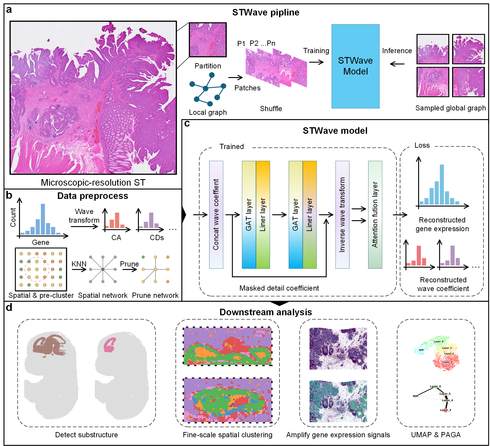

<div align="center">
  
  <h1 align="center">STWave: Fine-Scale Spatial Structure Discovery in Microscopic-Resolution Spatial Transcriptomics via Patchwise Wavelet Graphs</h1>

  

  <br/>

  <p align="center">
    <a href="https://github.com/TaoJiang999/STWave/stargazers"></a>
    <a href="https://github.com/TaoJiang999/STWave/network/members"></a>
    <a href="https://github.com/TaoJiang999/STWave/blob/main/LICENSE"></a>
    
    
  </p>
</div>

<br/>

> **👋 Welcome!** This document will help you easily configure, install, and get started with the **STWave** model.

## 📖 Introduction

**STWave** is a scalable framework explicitly designed for ultra-large microscopic-resolution spatial transcriptomics ($\mu$ST) data. By leveraging a **decoupled patch-based learning strategy** and **discrete wavelet transforms**, STWave enables extremely efficient analysis of millions of spots on standard hardware, guaranteeing constant memory consumption!

---

## 💻 System Requirements

### Operating System
`STWave` is cross-platform and can run smoothly on both **Linux** and **Windows**. It has been rigorously tested on:
- 🐧 **Linux**: Ubuntu 24.04.1 | NVIDIA GeForce RTX 3080 Ti GPU
- 🪟 **Windows**: Windows 10 | NVIDIA GeForce RTX 4060 GPU

### Software Prerequisites
- 🐍 **Python**: `>= 3.9` *(Tested successfully on Python 3.9.19)*
- 🟩 **CUDA**: `11.8` *(For Linux GPU acceleration)*

---

## ⚙️ Installation Guide

Follow these sequential steps to set up `STWave` in your environment.

### 1️⃣ Clone the Repository
```bash
git clone https://github.com/TaoJiang999/STWave.git
cd STWave
```

### 2️⃣ Create a Virtual Environment
We recommend using Conda to cleanly manage your dependencies.
```bash
conda create -n stwave python=3.9 r-base=4.4.2 r-mclust -c conda-forge -y
conda activate stwave
```

### 3️⃣ Install Core Dependencies
Install the required packages efficiently using the provided wheels:
```bash
# Install base requirements
pip install -r requirements.txt -i https://pypi.tuna.tsinghua.edu.cn/simple --extra-index-url https://download.pytorch.org/whl/cu118 -f https://data.pyg.org/whl/torch-2.2.0+cu118.html

# Install PyTorch Geometric extensions
pip install pyg_lib torch_scatter torch_sparse torch_cluster torch_spline_conv -f https://data.pyg.org/whl/torch-2.2.0+cu118.html
pip install torch_geometric
```

### 4️⃣ Verify Environment Setup
Ensure both R (via `rpy2`) and PyTorch are correctly configured:
```bash
python -c "import rpy2"
python -c "import torch; print('PyTorch Ver:', torch.__version__, '| CUDA Available:', torch.cuda.is_available(), '| CUDA Ver:', torch.version.cuda)"
```

### 5️⃣ Install STWave
Finally, install `STWave` into your environment:
```bash
pip install .
```

---

## 🚀 Get Started

### Tutorial
Ready to dive in? Check out our comprehensive, step-by-step tutorial:
👉 **[STWave Tutorial](https://github.com/TaoJiang999/STWave/tree/main/Tutorial)**

### Analysis
All custom scripts and code used for our research and analysis are available here:
🔬 **[Analysis Directory](https://github.com/TaoJiang999/STWave/tree/main/analysis)**

---

## 📝 Reference
*(Reference information goes here once published)*

---

## 💬 Contact & Support

If you encounter any issues, bugs, or have questions about the package, we are here to help!
- 🐛 **Issue Tracker**: Feel free to submit an issue on GitHub.
- 📧 **Email**: Reach out to us directly at [taoj@mails.cqjtu.edu.cn](mailto:taoj@mails.cqjtu.edu.cn).

